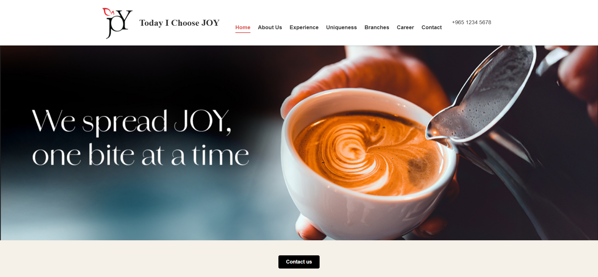

# Today I Choose JOY - Restaurant Website


This is a modern, responsive, single-page website for the "Today I Choose JOY" restaurant, built using only vanilla HTML, CSS, and JavaScript.



### ✨ Features

-   **Single-Page Application (SPA):** Seamless navigation between sections without page reloads.
-   **Fully Responsive:** Looks great on desktops, tablets, and mobile phones.
-   **Interactive Components:** Includes an auto-playing hero slider and a customer testimonial carousel.
-   **Dynamic Navigation:** The navigation bar, including the logo, updates to reflect the active page section.
-   **Pure Front-End:** Built with no frameworks or libraries for a lightweight and fast experience.

### 🛠️ Tech Stack

-   **HTML5**
-   **CSS3** (Flexbox, Grid, CSS Variables)
-   **JavaScript (ES6+)** (DOM Manipulation, Event Handling)

### 🚀 How to Run Locally

1.  Clone this repository:
    ```sh
    git clone https://github.com/your-username/joy-website.git
    ```
2.  Navigate to the project directory:
    ```sh
    cd joy-website
    ```
3.  Open the `index.html` file in your favorite web browser.
